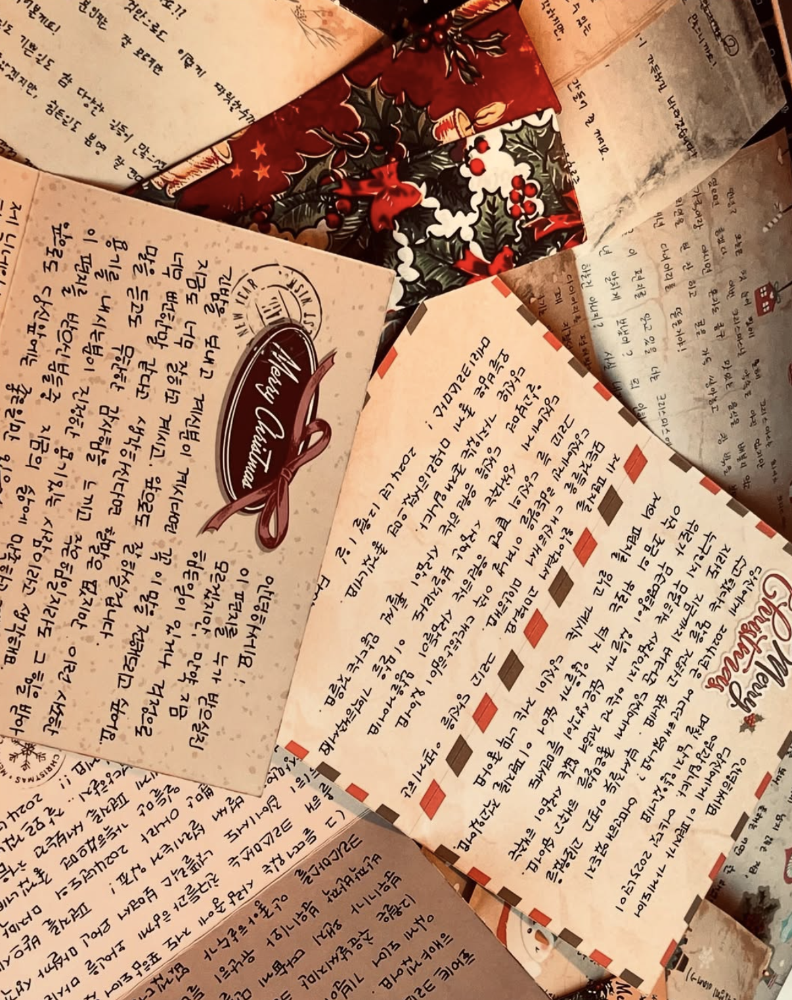
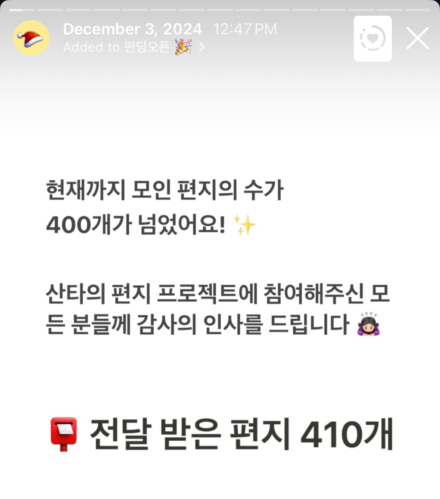
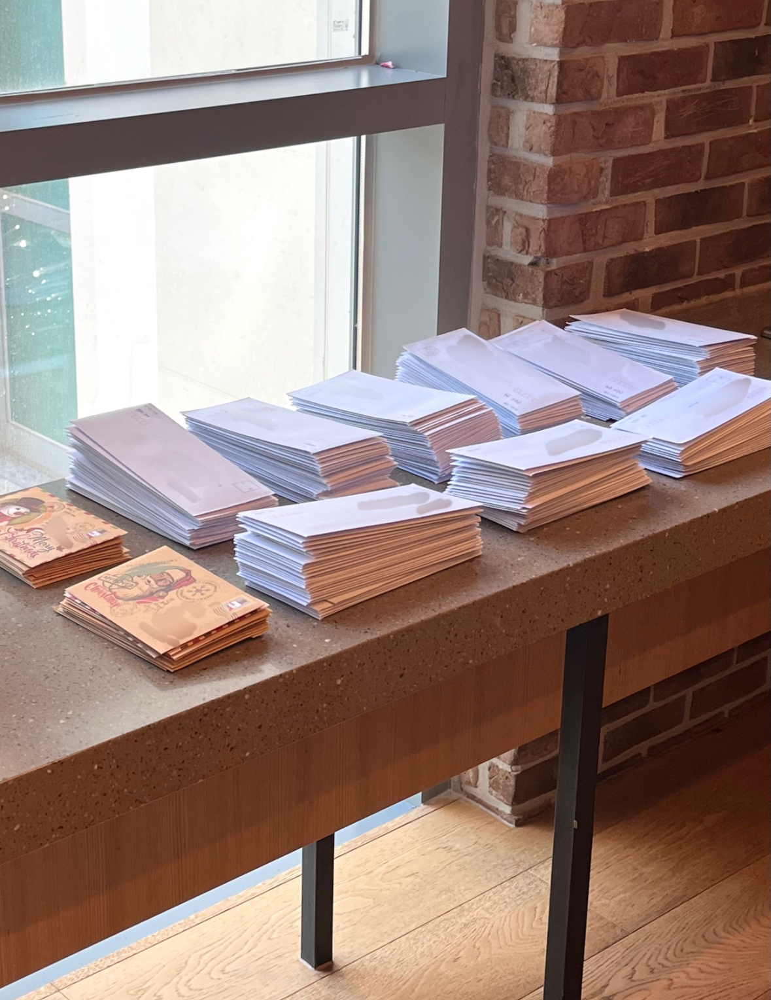

# 산타의 편지 

>익명으로 편지를 쓰고, 익명으로 편지를 받아보세요!  
산타들이 크리스마스 선물을 드릴게요 🎄🎅🏻

[인스타그램](https://www.instagram.com/santa.s_letter/profilecard/)을 눌러서 확인해보세요!

# 1. 프로젝트 설명
이 프로젝트는 웹사이트를 통해 익명의 누군가에게 편지를 보내고, 주소를 남기면 크리스마스에 또 다른 익명의 사람에게서 손편지를 받는 프로젝트입니다.

 
 

# 2. 주요기능
- 익명으로 편지 작성하기
- 주소 입력 및 저장
- 받고싶은 편지의 내용, 성별, 쓴사람의 나이 또는 상황 (ex.취준생, 대학생 등) 선택
- 크리스마스에 손편지 받기

# 3. 사용방법

[웹사이트 주소](https://santa-letter.site/)

# 4. 기술 스택

- HTML, CSS, JavaScript
- Node.js,

# 5. 프로젝트 동기
HTML, CSS, JS 등 학교에서 배운 기술스택들로, 실제 프로덕트를 만들고 실제로 가치를 제공해주고 싶어 이 프로젝트를 기획하게 됨.

때마침 크리스마스 시기와 겹쳐서, 크리스마를 위한 프로젝트를 만들기로 함.

사라져가는 감성을 되살리고자 사람들에게 크리스마스의 따뜻한 추억을 만들어 주기 위해 "랜덤 익명 손편지 프로젝트"를 기획하고 실행하게 되었음.

# 6. 성과
- 서버 배포 후 일주일안에 50명 유치
- 서버 배포 후 2주안에 200명 유치
- 서버 배포 후 3주안에 400명 유치

### 총 사용자 약 400명 유치 성공!

